## Source Paper

This code is the implementation of paper - 

**Faster R-CNN: Towards Real-Time Object Detection with Region Proposal Networks** 

[Link to Paper](https://arxiv.org/abs/1506.01497)

--------
## Training Data

PASCAL Visual Object Classes Challenge (2007) is used for training the network. 

The dataset has 20 classes for detection and recognition task. For this network only 7 classes are used - **aeroplane, bicycle, boat, bus, dog, train ,motorbike**

There are ~2000 images pertaining to these classes. ~100 images are used for validation. One batch consists of a single image. 

Data augmentation technique is used to reduce overfitting. 

--------

## Network Details

Network consists of 
* Anchors 
  * Corresponding to each image pixel in the convolution feature, there are 9 anchors at the scale of input image
  * Corresponding to a 50*50 conv feature, there will be 50 * 50 *9 anchors at the image scale 
  * Anchors are used for training the region proposal and decider network
  * All the predictions done are based on the anchors - e.g. if the anchor has object or Correction in the position of anchor
* Region Proposal Network - generates ROI from input image
  * Input image is resized to height (800) and width (800)
  * Pretrained VGG16 model is used for generating Conv features. For VGG16, the size of each conv features is 50*50 
  * Conv features are passed through another conv layer, which further branches out to 2 output layers. One output layer decides if the corresponding anchor has object or not. Another calculates the correction in anchor position if the anchor has object.

* Decider Network - proposes object classes from given ROI 
  * Corrected anchors from the region proposal network are passed through ROI pooling layer
  * Output of ROI pooling layer is passed through decider network
  * This network has 2 output layers. Class of ROI passed and the correction needed in ROI to accurately position the ROI around object. 

--------

## Training
Network is trained on google colab GPU.

A single image is considered as a training batch.

## Training Loss 

Average training loss per 20 iterations is calculated. Here is the graph - 

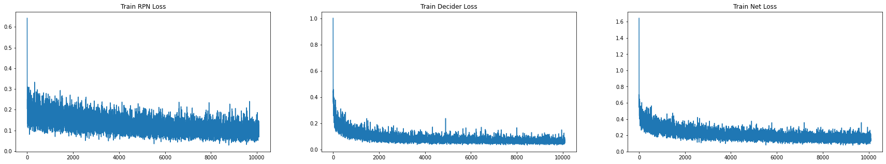

## Validation Loss

After each epoch, network is validated on the validation dataset. Here is the graph - 

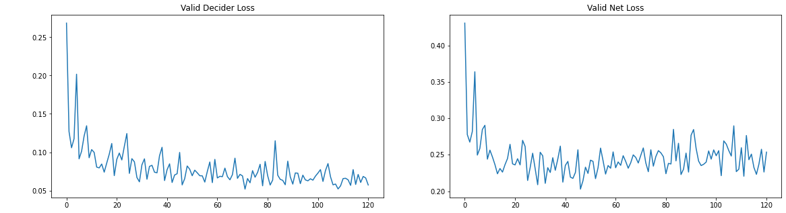

There is a overfitting that can be seen in Net loss. This is due to overfitting in the RPN layer of the faster-rcnn network. Strangely, the increase of validation loss does not correspond to incorrect prediction. I believe, using detection validation schema similar to MAP can help in addressing this issue. 

## Detection Demo Images 

NMS is applied on the final predictions. Since, the network is not trained according to validation schema such as MAP optimization, this is not the optimized network. 

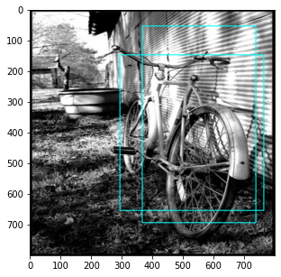
--- 
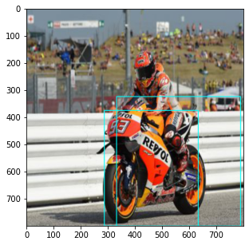
--- 
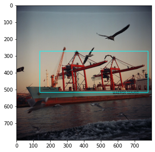
--- 
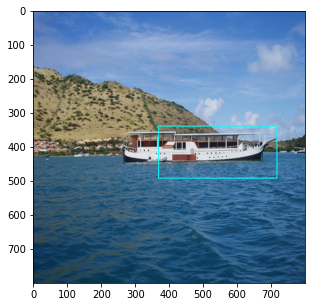
--- 
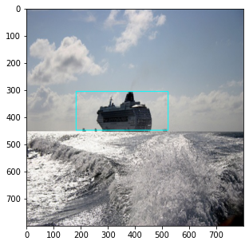
--- 
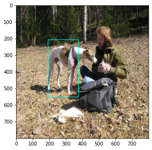
--- 
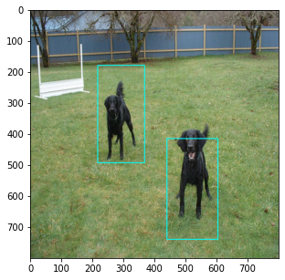
--- 
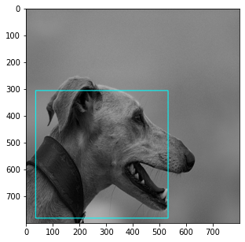
--- 
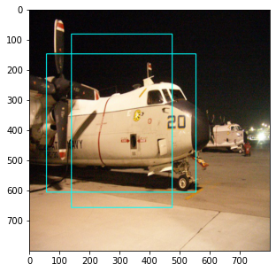
--- 
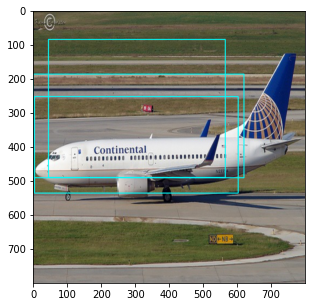
--- 
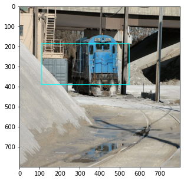
--- 
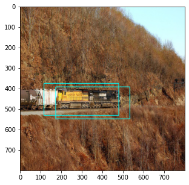
--- 