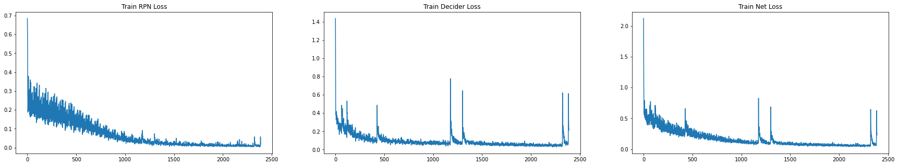
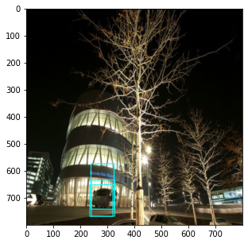
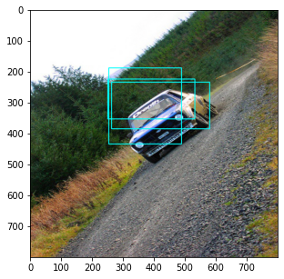
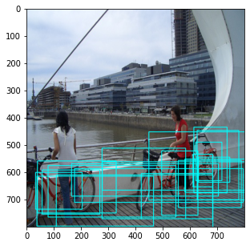
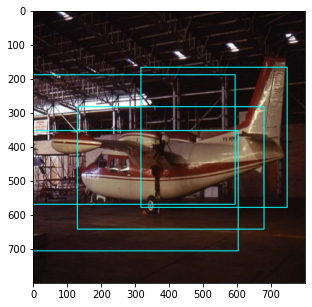
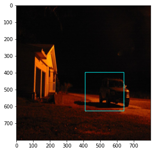

## Source Paper

This code is the implementation of paper - 

**Faster R-CNN: Towards Real-Time Object Detection with Region Proposal Networks** 

[Link to Paper](https://arxiv.org/abs/1506.01497)

--------
## Training Data

PASCAL Visual Object Classes Challenge (2007) is used for training the network. 

The dataset has 20 classes for detection and recognition task. For this network only 6 classes are used - **aeroplane, bicycle, boat, bus, car, train, motorbike**

There are ~2000 images pertaining to these classes. 150 images are used for validation. One batch consists of a single image. 

No Data augmentation techniques are used, since the aim is not to obtain best results on validation set, but to obtain good enough detection results. Data augmentation could be used to improve performance.

--------

## Network Details

Network consists of 
* Anchors 
  * Corresponding to each image pixel in the convolution feature, there are 9 anchors at the scale of input image
  * Corresponding to a 50*50 conv feature, there will be 50 * 50 *9 anchors at the image scale 
  * Anchors are used for training the region proposal and decider network
  * All the predictions done are based on the anchors - e.g. if the anchor has object or Correction in the position of anchor
* Region Proposal Network - generates ROI from input image
  * Input image is resized to height (800) and width (800)
  * Pretrained VGG16 model is used for generating Conv features. For VGG16, the size of each conv features is 50*50 
  * Conv features are passed through another conv layer, which further branches out to 2 output layers. One output layer decides if the corresponding anchor has object or not. Another calculates the correction in anchor position if the anchor has object.

* Decider Network - proposes object classes from given ROI 
  * Corrected anchors from the region proposal network are passed through ROI pooling layer
  * Output of ROI pooling layer is passed through decider network
  * This network has 2 output layers. Class of ROI passed and the correction needed in ROI to accurately position the ROI around object. 

--------

## Training
Network is trained on google colab GPU. Network in not completely trained as training takes a lot of time. Getting a fully optimized model can take a longer time give that colab training disconnects / resets and there is a usage limit on colab. 

A single image is considered as a training batch. Trained the network for ~20 epochs. 

## Training Loss 

Average training loss per 20 iterations is calculated, here is the graph, 

The spikes in the graph is when training is resumed from a checkpoint. Not sure about the reason for this even though the optimiser state dict is loaded while loading the model. 

Later figured, this was because of a very silly data loading mistake. Fixed in the YOLO implementation repo. 

Since, there are spikes when the training is resumed, using the weights of pretrained models does not produce correct results. 

## Detection Demo Images 

The network is not optimised. Better results could be obtained bt training the network for more epochs. But, even with small training network does a good enough job to identify regions where object is present in the image. 

NMS could be applied here to get better and lesser bounding boxes for objects in image

Few results from the validation set :

Target - car

--- 

Target - car
--- 

Target - bicycle

--- 

Target - aeroplane

--- 

Target - car
